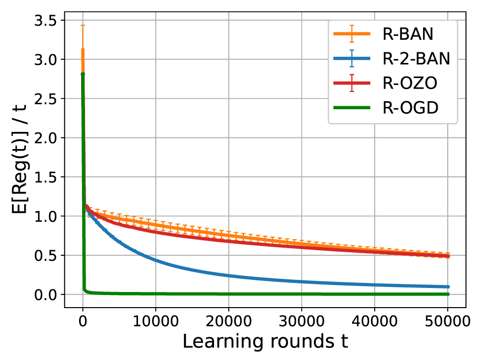
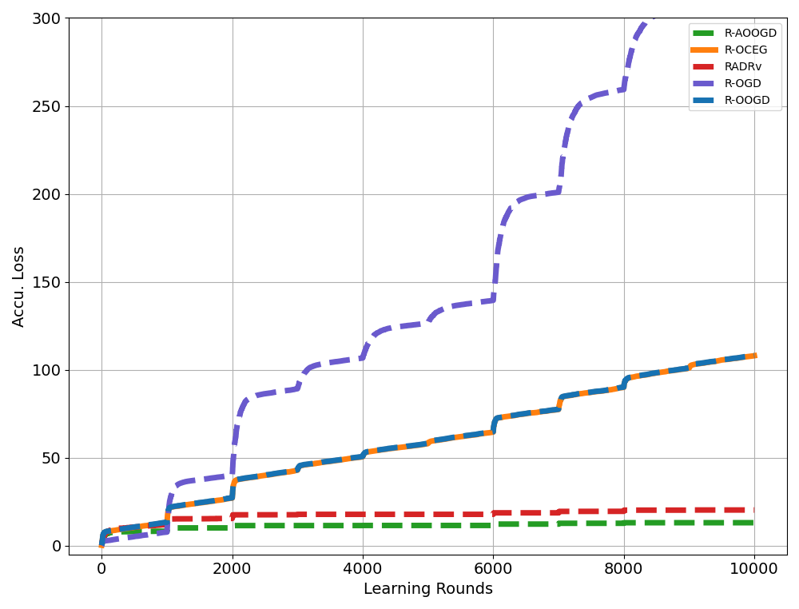

## First-order Algorithm for Riemannian Online Optimization  

We consider the online optimization on Riemannian manifolds in the full information setting, 
where a learner sequentially interacts with the environment by observing function values or gradients on a Riemannian manifold.
The goal is to minimize the regret of the learner, which measures the deviation of the learner's performance from the fixed optimal solution.   

To address the problem, we introduce the Riemannian Online Gradient Descent (R-OGD) algorithm, where the exponetial map is utilized to present the gradient descent. Our algorithm delivers regret bounds of $\mathcal O(\sqrt{T})$ and $\mathcal O(\log T)$ for geodesically convex (g-convex) and strongly geodesically convex functions, respectively, on Hadamard manifolds. Additionally, we extend these bounds to manifolds with positive curvature by effectively addressing the challenges associated with non-constrictive projection maps. At last, we establish a universal lower regret bound of $\Omega(\sqrt{T})$ for g-convex functions in the worst case, demonstrating the optimality of the regret bound achieved by R-OGD.

## Bandit Algorithm for Riemannian Online Optimization  

We also investigate the problem of Riemannian online optimization under partial information feedback. A typical example is the online optimization problem under bandit feedback. In bandit feedback setting, the learner can only observe the function values of the loss function and do not have access to gradient information, rendering gradient-based optimization algorithms inapplicable. 

In order to address the bandit feedback, we introduce a key technique that leverages the homogeneity of the Riemannian manifold to design a bandit gradient estimator. Based on this, we propose the Riemannian bandit algorithm, which achieves regret bounds of $\mathcal O(T^{3/4})$ and $\mathcal O(T^{2/3})$ for geodesically convex and strongly geodesically convex functions, respectively. Furthermore, we extend our approach to the two-point feedback setting and propose the Riemannian two-point bandit algorithm. The regret bounds of the Riemannian two-point bandit algorithm are shown to be $\mathcal O(\sqrt{T})$ and $\mathcal O(\log T)$ for geodesically convex and strongly geodesically convex functions, respectively, which coincides with the order in the full information setting.

## Riemannian Optimistic Algorithm

We focus on the dynamic regret of Riemannian online optimization, where the cumulative losses is compared with a sequence of comparators. By analyzing dynamic regret, we gain insights into the evolving performance of algorithms and quantify their adaptability to changing environments and uncertainties.

In light of this, we introduce the Riemannian Online Optimistic Gradient Descent (R-OOGD) and the Riemannian Adaptive Online Optimistic Gradient Descent. By incorporating the information from previous gradients, the algorithm update adaptively, leading to improved performance of dynamic regret. Furthermore, we have developed dynamic regret bounds of both R-OOGD and R-AOOGD, which are formulated in terms of gradient variations and path length, providing insights into the adaptability of our algorithms in dynamic optimization scenarios.

Last but not least, we appliy the optimistic method to Riemannian two-player zero-sum games, achieving average-iterate convergence of $\mathcal O (1/T)$ and best-iterate convergence of $\mathcal O(1/\sqrt T)$ for g-convex-concave games, as well as last-iterate convergence for g-strongly-convex strongly-concave games.

